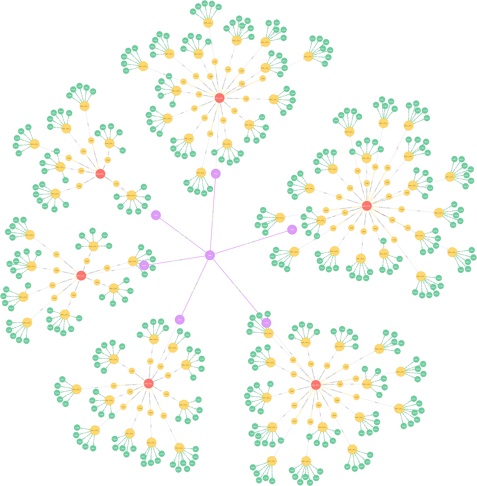
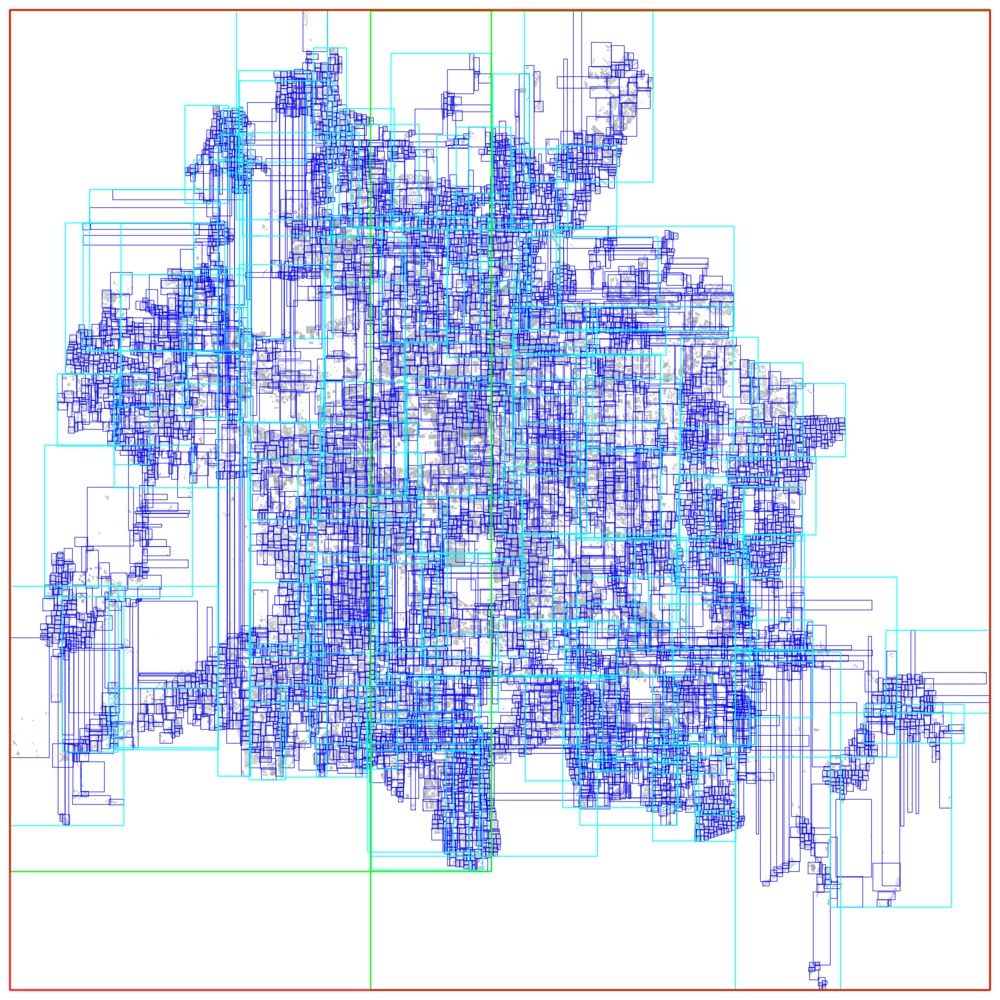

*This page is currently under development.*

# Introduction

A city may have multiple CityGML documents recorded at different times or surveyed by different users. To analyse the city’s evolution over a given period of time, as well as to update or edit the city model without negating modifications made by other users, it is of utmost importance to first compare, detect and locate spatio-semantic changes between CityGML datasets. This is however difficult due to the fact that CityGML elements belong to a complex hierarchical structure containing multi-level deep associations, which can basically be considered as a graph. Moreover, CityGML allows multiple syntactic ways to define an object leading to syntactic ambiguities in the exchange format. Furthermore, CityGML is capable of including not only 3D urban objects’ graphical appearances but also their
semantic properties. Since to date, no known algorithm is capable of detecting spatio-semantic changes in CityGML documents, a frequent approach is to replace the older models completely with the newer ones, which not only costs computational resources, but also loses track of collaborative and chronological changes. Thus, this research proposes an approach capable of comparing two arbitrarily large-sized CityGML documents on both semantic and geometric level. Detected deviations are then attached to their respective sources and can easily be retrieved on demand. As a result, updating a 3D city model using this approach is much more efficient as only real changes are committed. To achieve this, the research employs a graph database as the main data structure for storing and processing CityGML datasets in three major steps: mapping, matching and updating. The mapping process transforms input CityGML documents into respective graph representations. The matching process compares these graphs and attaches edit operations on the fly. Found changes can then be executed using the Web Feature Service (WFS), the standard interface for updating geographical features across the web.

The (ongoing) implementation of this research is stored and maintained in this repository.




# Repository Structure

This repository contains the following folders:

* [export](export/): If deviations are found between two city models, the corresponding edit operations created on-the-fly shall be documented here in 6 CSV files. Fore more information please refer to the respective [README](export/README.md) there.


* [logs](logs/): Program and execution logs are stored here for debugging purposes.


* [neo4jDB](neo4jDB/): The Neo4j database instance employed during program execution shall be stored here. For querying and visualization purposes, the Neo4j web client can be pointed to this location. Note that the size of this database tends to increase over time as more and more transaction logs are stored. These data can be removed. However, do NOT remove this folder.


* [portable](portable/): The **stand-alone version** is included here. For more information, please refer to the respective [README](portable/README.md) there.


* [saved_pictures](saved_pictures/): If spatial matching strategy R-tree is enabled, R-tree pictures of input city models shall be created and stored here. These signature pictures visualized R-trees of respective city models by representing each R-tree node as a rectangle, while their colors indicate node levels in the R-tree (see illustrations below).


* [saved_settings](saved_settings/): Some useful run configurations can be found here. For more information, please refer to the respective [README](saved_settings/README.md) there.


* [src](src/main/java/): Source codes can be found in this location, which consists of the following packages:

    * [controller](src/main/java/controller/): The main method contained in this package controls how the whole program behaves.
    
    * [editor](src/main/java/editor/): Implemented for updating the old city model using the created edit opeartions and WFS.
    
    * [exporter](src/main/java/exporter/): Employed to export created edit operations to CSV files.
    
    * [mapper](src/main/java/mapper/): The mapping process that is capable of mapping CityGML objects to respective (sub) graphs in Neo4j.
    
    * [matcher](src/main/java/matcher/): The matching process that is implemented to compare graph representations of city models, detect their deviations and create edit operations accordingly.
    
    * [util](src/main/java/util/): Contains auxiliary classes.
    

* [test_data](test_data/): Input CityGML city models are supposed to be stored here.


**IMPORTANT:** The configuration file [Default.txt](saved_settings/Default.txt) dictates which folders shall be used for which data. The above-mentioned structure follows therefore only the default configurations.





# System Requirements


The application employs the graph database **Neo4j** as a means to store and process CityGML datasets. The system must thus meet the **_minimum_** requirements listed in [Neo4j Operations Manual](https://neo4j.com/docs/operations-manual/current/installation/requirements/).


## Minimum Software Requirements

- **Java**:

&nbsp;&nbsp;&nbsp;&nbsp;&nbsp;&nbsp;&nbsp;&nbsp;&nbsp;&nbsp;&nbsp;&nbsp;&nbsp;&nbsp;
[OpenJDK 8](http://openjdk.java.net/)

&nbsp;&nbsp;&nbsp;&nbsp;&nbsp;&nbsp;&nbsp;&nbsp;&nbsp;&nbsp;&nbsp;&nbsp;&nbsp;&nbsp;
[Oracle Java 8](http://www.oracle.com/technetwork/java/javase/downloads/index.html)

&nbsp;&nbsp;&nbsp;&nbsp;&nbsp;&nbsp;&nbsp;&nbsp;&nbsp;&nbsp;&nbsp;&nbsp;&nbsp;&nbsp;
[IBM Java 8](http://www.ibm.com/developerworks/java/jdk/)   
    
    
- **Operating Systems (OS)**:

&nbsp;&nbsp;&nbsp;&nbsp;&nbsp;&nbsp;&nbsp;&nbsp;&nbsp;&nbsp;&nbsp;&nbsp;&nbsp;&nbsp;
Ubuntu 14.04, 16.04

&nbsp;&nbsp;&nbsp;&nbsp;&nbsp;&nbsp;&nbsp;&nbsp;&nbsp;&nbsp;&nbsp;&nbsp;&nbsp;&nbsp;
Debian 8, 9

&nbsp;&nbsp;&nbsp;&nbsp;&nbsp;&nbsp;&nbsp;&nbsp;&nbsp;&nbsp;&nbsp;&nbsp;&nbsp;&nbsp;
CentOS 6, 7

&nbsp;&nbsp;&nbsp;&nbsp;&nbsp;&nbsp;&nbsp;&nbsp;&nbsp;&nbsp;&nbsp;&nbsp;&nbsp;&nbsp;
Fedora, Red Hat, Amazon Linux

&nbsp;&nbsp;&nbsp;&nbsp;&nbsp;&nbsp;&nbsp;&nbsp;&nbsp;&nbsp;&nbsp;&nbsp;&nbsp;&nbsp;
Windows Server 2012


- **Architectures**:

&nbsp;&nbsp;&nbsp;&nbsp;&nbsp;&nbsp;&nbsp;&nbsp;&nbsp;&nbsp;&nbsp;&nbsp;&nbsp;&nbsp;
x86 (32 bit)

&nbsp;&nbsp;&nbsp;&nbsp;&nbsp;&nbsp;&nbsp;&nbsp;&nbsp;&nbsp;&nbsp;&nbsp;&nbsp;&nbsp;
OpenPOWER (POWER8)


## Minimum Hardware Requirements

- **Central Processing Unit (CPU)**:

&nbsp;&nbsp;&nbsp;&nbsp;&nbsp;&nbsp;&nbsp;&nbsp;&nbsp;&nbsp;&nbsp;&nbsp;&nbsp;&nbsp;
Intel Core i3

&nbsp;&nbsp;&nbsp;&nbsp;&nbsp;&nbsp;&nbsp;&nbsp;&nbsp;&nbsp;&nbsp;&nbsp;&nbsp;&nbsp;
*Recommended: Intel Core i7 or IBM POWER8*
    
    
- **Random Access Memory (RAM)**:

&nbsp;&nbsp;&nbsp;&nbsp;&nbsp;&nbsp;&nbsp;&nbsp;&nbsp;&nbsp;&nbsp;&nbsp;&nbsp;&nbsp;
2GB

&nbsp;&nbsp;&nbsp;&nbsp;&nbsp;&nbsp;&nbsp;&nbsp;&nbsp;&nbsp;&nbsp;&nbsp;&nbsp;&nbsp;
*Recommended: 16 - 32GB or more*


- **Storage**:

&nbsp;&nbsp;&nbsp;&nbsp;&nbsp;&nbsp;&nbsp;&nbsp;&nbsp;&nbsp;&nbsp;&nbsp;&nbsp;&nbsp;
10GB HDD via SATA

&nbsp;&nbsp;&nbsp;&nbsp;&nbsp;&nbsp;&nbsp;&nbsp;&nbsp;&nbsp;&nbsp;&nbsp;&nbsp;&nbsp;
*Recommended: 200GB SSD via SATA or PCIe*


# Installation

## Windows

1. Import this project into IDE of choice (such as Eclipse, NetBeans, etc. ) using Maven. The required artifacts can be found in [pom.xml](pom.xml). 

2. Once imported, these artifacts/dependencies shall be automatically downloaded to the local system.

3. After the project has been built, navigate to [Controller.java](src/main/java/controller/Controller.java).

4. Change the test file names to suit your needs. The test files are located by default in folder [test_data](test_data/). The default settings are stored in [Default.txt](saved_settings/Default.txt). Log files are written in folder [logs](logs/). R-tree signature pictures of tested CityGML documents can be found in folder [rtrees](saved_pictures/rtrees/).

Alternatively, the application can be executed in command line (see Linux).

## Linux

For Linux and all other platforms, the folder [portable](portable/) was generated to contain executable Jar file and its dependencies. The Jar file can be executed in command line (see Setup Configurations).

# Setup Configurations

## Windows

The run configurations in selected IDE may contain the following options:
```batch
-Xms8192m -Xmx8192m -XX:+UseG1GC
```

`-Xms` and `-Xmx` indicate the initial and maximum amount of main memory (heap space) assigned to the application. In this example, both the initial and maximum heap space are 8192MB or 8GB.

`-XX:+UseG1GC` means that the concurrent garbage collector `G1GC` is employed. Note that to save memory, the JVM employs the Compressed Ordinary Object Pointer (OOP) feature that compresses object references. This feature is enabled by default in latest versions of JDK. The compressed OOPs is activated in 64-bit JVM if the value of flag `-Xmx` is undefined or smaller than 32 GB. Therefore, a maximum heap space size value of 32 GB and beyond shall deactivate the compressed OOP and thus might cause marginal or negative gains in performance, unless the increase in size is significant (64GB or above) as stated in [Neo4j Operations Manual](https://neo4j.com/docs/operations-manual/current/).

The application settings are stored by default in [Default.txt](saved_settings/Default.txt). Change the values to suit your needs.

Alternatively, the application can be also configured in command line (see Linux).
	
## Linux:

Navigate to the folder [portable](portable/). Then execute the following command:
```shell
java -Xms8192m -Xmx8192m -XX:+UseG1GC -jar Filename.jar -SETTINGS="PathToSettings.txt"
```
	
The options `-Xms` and `-Xmx` are explained previously (see Windows).

The name `Filename.jar` is the location of the executable Jar file. This can be absolute or relative path.

The option `PathToSettings.txt` indicates the location of the text file storing all configurations.


# Reading and Understanding Results

The application consists of three part: mapping, matching and updating CityGML datasets. Each of these steps can be configured to run in stand-alone mode (see [Controller.java](src/main/java/controller/Controller.java)). 

For example, if the matching and updating process are deactivated in [Default.txt](saved_settings/Default.txt), then only the mapping process is executed. On the other hand, for an existing database, the mapping process can be skipped. The same applies for an existing database with edit operations already attached, both the mapping and matching process can be skipped, so that only the updating process is applied.

At the end of each run session, the application summarizes the statistics of created graph database containing node labels and their frequencies in descending order. A summary of attached edit operations (if available) is also shown together with their contents and locations. In case the updating process is activated, the WFS HTTP POST contents and the corresponding server responses are also displayed.
