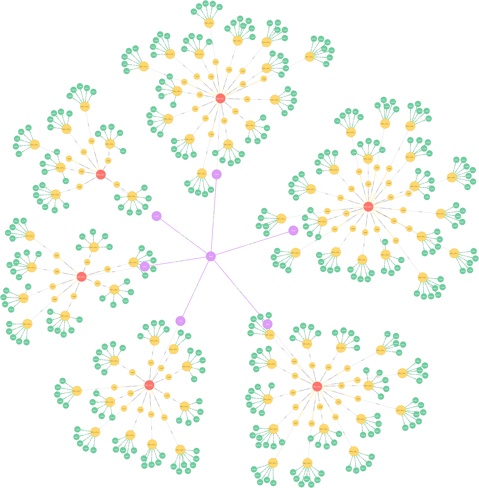
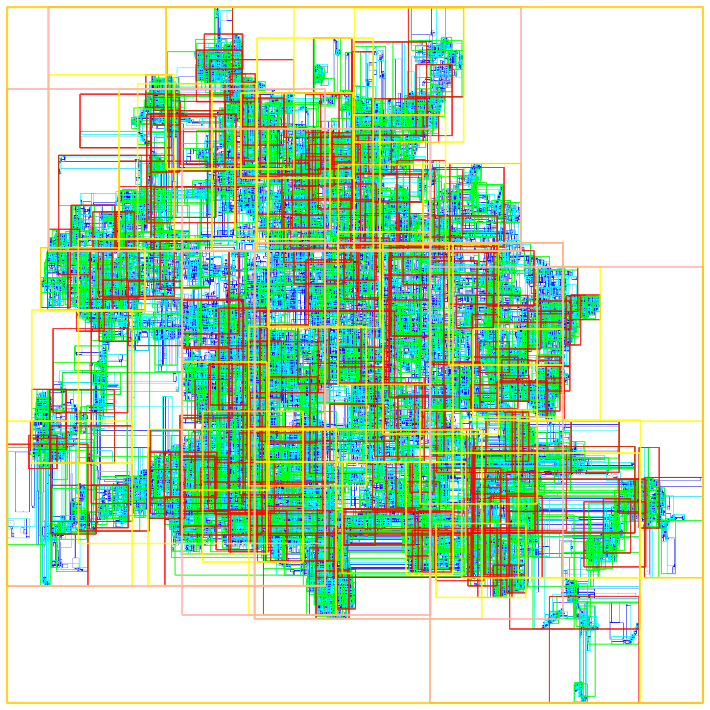
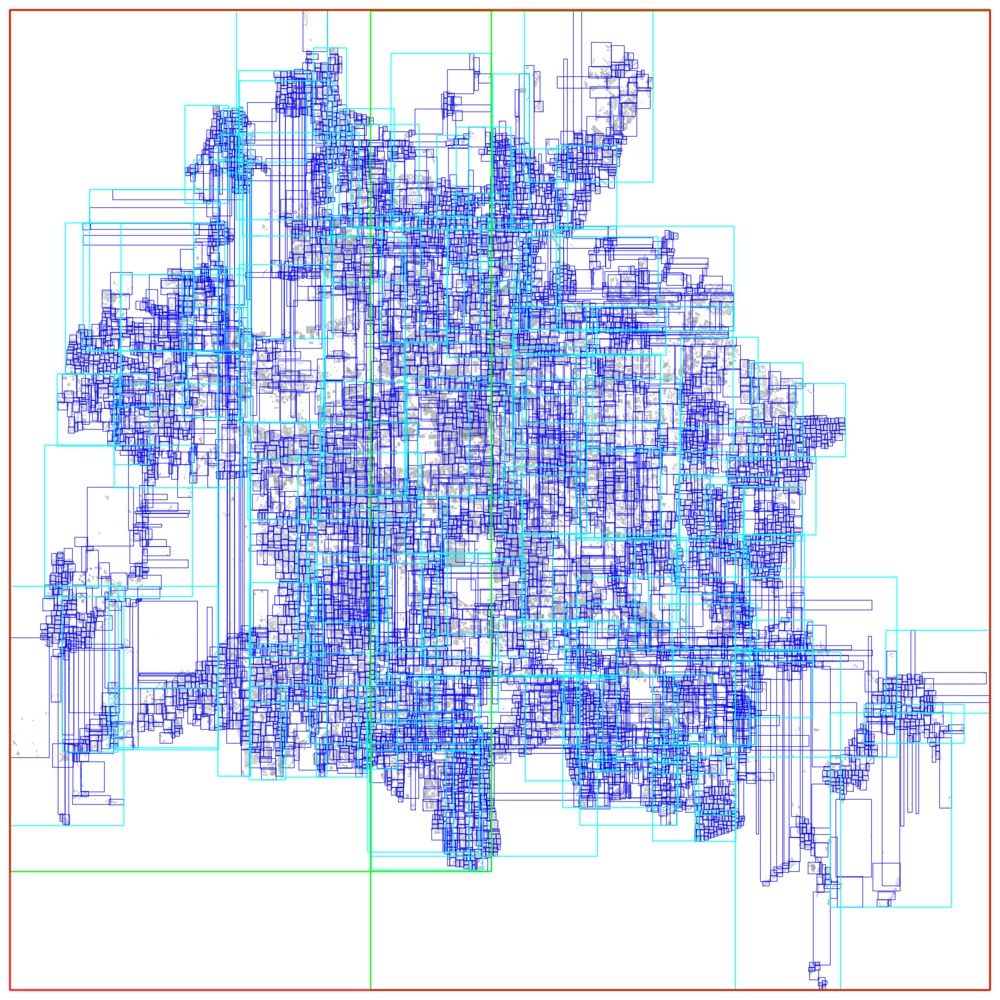

# *CityGML Change Detection* 

#### A high-performance graph-based tool for automatic change detection in massive CityGML datasets

[  ](https://bintray.com/tum-gis/maven/citygml-change-detection/_latestVersion)

# Publication:

This project is a part of the on-going PhD research of [Son H. Nguyen](https://www.lrg.tum.de/en/gis/our-team/staff/son-h-nguyen/) at the Chair of Geoinformatics, Department of Aerospace and Geodesy, Technical University of Munich.
For more information on the research, please refer to the following published studies:

* Son H. Nguyen, Thomas H. Kolbe. ["A MULTI-PERSPECTIVE APPROACH TO INTERPRETING SPATIO-SEMANTIC CHANGES OF LARGE 3D CITY MODELS IN CITYGML USING A GRAPH DATABASE"](https://www.isprs-ann-photogramm-remote-sens-spatial-inf-sci.net/VI-4-W1-2020/143/2020/), ISPRS Ann. Photogramm. Remote Sens. Spatial Inf. Sci., VI-4/W1-2020, 143–150, https://doi.org/10.5194/isprs-annals-VI-4-W1-2020-143-2020, 2020. 

* Son H. Nguyen, Zhihang Yao, Thomas H. Kolbe. ["SPATIO-SEMANTIC COMPARISON OF LARGE 3D CITY MODELS IN CITYGML USING A GRAPH DATABASE."](https://www.isprs-ann-photogramm-remote-sens-spatial-inf-sci.net/IV-4-W5/99/2017/), ISPRS Ann. Photogramm. Remote Sens. Spatial Inf. Sci., IV-4/W5, 99-106, https://doi.org/10.5194/isprs-annals-IV-4-W5-99-2017, 2017.

* Son H. Nguyen. ["SPATIO-SEMANTIC COMPARISON OF 3D CITY MODELS IN CITYGML USING A GRAPH DATABASE."](https://mediatum.ub.tum.de/node?id=1374646) Master's Thesis. Department of Informatics, Technical University of Munich (TUM).

We acknowledge the company [CADFEM](https://www.cadfem.net/de/en/), [Virtual City Systems](https://vc.systems/en/) and the 
[Leonhard Obermeyer Center (LOC)](https://www.loc.tum.de/en/home/) of the 
[Technical University of Munich (TUM)](https://www.tum.de/en/) for supporting this work. We also would like to thank
the [Bavarian Agency for Digitisation, High-Speed Internet and Surveying (LDBV)](https://www.ldbv.bayern.de/englisch.html) 
and the [state government of North Rhine-Westphalia](https://www.land.nrw/en) for providing the input datasets.

# Introduction

A city may have multiple CityGML documents recorded at different times or surveyed by different users. To analyse the city’s evolution over a given period of time, as well as to update or edit the city model without negating modifications made by other users, it is of utmost importance to first compare, detect and locate spatio-semantic changes between CityGML datasets. This is however difficult due to the fact that CityGML elements belong to a complex hierarchical structure containing multi-level deep associations, which can basically be considered as a graph. Moreover, CityGML allows multiple syntactic ways to define an object leading to syntactic ambiguities in the exchange format. Furthermore, CityGML is capable of including not only 3D urban objects’ graphical appearances but also their
semantic properties. Since to date, no known algorithm is capable of detecting spatio-semantic changes in CityGML documents, a frequent approach is to replace the older models completely with the newer ones, which not only costs computational resources, but also loses track of collaborative and chronological changes. Thus, this research proposes an approach capable of comparing two arbitrarily large-sized CityGML documents on both semantic and geometric level. Detected deviations are then attached to their respective sources and can easily be retrieved on demand. As a result, updating a 3D city model using this approach is much more efficient as only real changes are committed. To achieve this, the research employs a graph database as the main data structure for storing and processing CityGML datasets in three major steps: mapping, matching and updating. The mapping process transforms input CityGML documents into respective graph representations. The matching process compares these graphs and attaches edit operations on the fly. Found changes can then be executed using the Web Feature Service (WFS), the standard interface for updating geographical features across the web.

The (ongoing) implementation of this research is stored and maintained in this repository.




# License

The **citygml-change-detection** repository is licensed under the [Apache License, Version 2.0](http://www.apache.org/licenses/LICENSE-2.0). See the [LICENSE](LICENSE) file for more details.


# Repository Structure

This repository contains the following folders:

| Directory         | Description                                                                                                                                                                                                                                                                                            |
|-------------------|--------------------------------------------------------------------------------------------------------------------------------------------------------------------------------------------------------------------------------------------------------------------------------------------------------|
| [input](input/)   | Location of input CityGML datasets                                                                                                                                                                                                                                                                     |
| [output](output/) | Location of output files and directories generated while executing the change detection process, this includes [detected changes in CSV files](output/changes/), [log files](output/logs/), [RTree footprints of imported top-level features](output/rtrees/) and [statistics report](output/statbot/) |
| [config](config/) | Location of example settings that can be applied for the change detection process, especially the [default settings](config/Default.txt)                                                                                                                                                               |


**IMPORTANT:** The change detection process requires a config file. 
The default configuration file [Default.txt](config/Default.txt) is an example of how to adjust these settings.





# System Requirements


The application employs the graph database **Neo4j** as a means to store and process CityGML datasets. The system must thus meet the **_minimum_** requirements listed in [Neo4j Operations Manual](https://neo4j.com/docs/operations-manual/current/installation/requirements/).


## Minimum Software Requirements

- **Java**:

&nbsp;&nbsp;&nbsp;&nbsp;&nbsp;&nbsp;&nbsp;&nbsp;&nbsp;&nbsp;&nbsp;&nbsp;&nbsp;&nbsp;
[OpenJDK 8](http://openjdk.java.net/)

&nbsp;&nbsp;&nbsp;&nbsp;&nbsp;&nbsp;&nbsp;&nbsp;&nbsp;&nbsp;&nbsp;&nbsp;&nbsp;&nbsp;
[Oracle Java 8](http://www.oracle.com/technetwork/java/javase/downloads/index.html)

&nbsp;&nbsp;&nbsp;&nbsp;&nbsp;&nbsp;&nbsp;&nbsp;&nbsp;&nbsp;&nbsp;&nbsp;&nbsp;&nbsp;
[IBM Java 8](http://www.ibm.com/developerworks/java/jdk/)   
    
    
- **Operating Systems (OS)**:

&nbsp;&nbsp;&nbsp;&nbsp;&nbsp;&nbsp;&nbsp;&nbsp;&nbsp;&nbsp;&nbsp;&nbsp;&nbsp;&nbsp;
Ubuntu 14.04, 16.04

&nbsp;&nbsp;&nbsp;&nbsp;&nbsp;&nbsp;&nbsp;&nbsp;&nbsp;&nbsp;&nbsp;&nbsp;&nbsp;&nbsp;
Debian 8, 9

&nbsp;&nbsp;&nbsp;&nbsp;&nbsp;&nbsp;&nbsp;&nbsp;&nbsp;&nbsp;&nbsp;&nbsp;&nbsp;&nbsp;
CentOS 6, 7

&nbsp;&nbsp;&nbsp;&nbsp;&nbsp;&nbsp;&nbsp;&nbsp;&nbsp;&nbsp;&nbsp;&nbsp;&nbsp;&nbsp;
Fedora, Red Hat, Amazon Linux

&nbsp;&nbsp;&nbsp;&nbsp;&nbsp;&nbsp;&nbsp;&nbsp;&nbsp;&nbsp;&nbsp;&nbsp;&nbsp;&nbsp;
Windows Server 2012


- **Architectures**:

&nbsp;&nbsp;&nbsp;&nbsp;&nbsp;&nbsp;&nbsp;&nbsp;&nbsp;&nbsp;&nbsp;&nbsp;&nbsp;&nbsp;
x86 (32 bit)

&nbsp;&nbsp;&nbsp;&nbsp;&nbsp;&nbsp;&nbsp;&nbsp;&nbsp;&nbsp;&nbsp;&nbsp;&nbsp;&nbsp;
OpenPOWER (POWER8)


## Minimum Hardware Requirements

- **Central Processing Unit (CPU)**:

&nbsp;&nbsp;&nbsp;&nbsp;&nbsp;&nbsp;&nbsp;&nbsp;&nbsp;&nbsp;&nbsp;&nbsp;&nbsp;&nbsp;
Intel Core i3

&nbsp;&nbsp;&nbsp;&nbsp;&nbsp;&nbsp;&nbsp;&nbsp;&nbsp;&nbsp;&nbsp;&nbsp;&nbsp;&nbsp;
*Recommended: Intel Core i7 or IBM POWER8*
    
    
- **Random Access Memory (RAM)**:

&nbsp;&nbsp;&nbsp;&nbsp;&nbsp;&nbsp;&nbsp;&nbsp;&nbsp;&nbsp;&nbsp;&nbsp;&nbsp;&nbsp;
2GB

&nbsp;&nbsp;&nbsp;&nbsp;&nbsp;&nbsp;&nbsp;&nbsp;&nbsp;&nbsp;&nbsp;&nbsp;&nbsp;&nbsp;
*Recommended: 16 - 32GB or more*


- **Storage**:

&nbsp;&nbsp;&nbsp;&nbsp;&nbsp;&nbsp;&nbsp;&nbsp;&nbsp;&nbsp;&nbsp;&nbsp;&nbsp;&nbsp;
10GB HDD via SATA

&nbsp;&nbsp;&nbsp;&nbsp;&nbsp;&nbsp;&nbsp;&nbsp;&nbsp;&nbsp;&nbsp;&nbsp;&nbsp;&nbsp;
*Recommended: 200GB SSD via SATA or PCIe*


# Installation and Run

### 1. Installation

The simplest and fastest way to get the program up and running is to import this project from [Bintray JCenter](https://bintray.com/tum-gis/maven/citygml-change-detection).
Simply add the following lines in the respective option file.

**NOTE**: Replace ``VERSION`` with the desired release version 
(see [release list](https://bintray.com/tum-gis/maven/citygml-change-detection)).

##### Maven

```
<dependency>
  <groupId>tum-gis</groupId>
  <artifactId>citygml-change-detection</artifactId>
  <version>VERSION</version>
  <type>pom</type>
</dependency>
```

##### Maven

```
dependencies {
    implementation 'tum-gis:citygml-change-detection:VERSION'
}
```

##### Ivy

```
<dependency org='tum-gis' name='citygml-change-detection' rev='VERSION'>
  <artifact name='citygml-change-detection' ext='pom' ></artifact>
</dependency>
```


### 2. Run

### Run in IDE

After the configuration file has been modified, rebuild the project to download all the dependencies needed.
Then start the program using the following code:

```java
CityGMLChangeDetection program = new CityGMLChangeDetection("config.txt");
program.execute();
```

The ``config.txt`` file contains all configuration parameters needed by the software. 
These parameteres are defined [here](config/Default.txt).


### Run in Command Line

##### Windows

The run configurations in selected IDE may contain the following options:
```batch
-Xms8192m -Xmx8192m -XX:+UseG1GC
```

`-Xms` and `-Xmx` indicate the initial and maximum amount of main memory (heap space) assigned to the application. In this example, both the initial and maximum heap space are 8192MB or 8GB.

`-XX:+UseG1GC` means that the concurrent garbage collector `G1GC` is employed. Note that to save memory, the JVM employs the Compressed Ordinary Object Pointer (OOP) feature that compresses object references. This feature is enabled by default in latest versions of JDK. The compressed OOPs is activated in 64-bit JVM if the value of flag `-Xmx` is undefined or smaller than 32 GB. Therefore, a maximum heap space size value of 32 GB and beyond shall deactivate the compressed OOP and thus might cause marginal or negative gains in performance, unless the increase in size is significant (64GB or above) as stated in [Neo4j Operations Manual](https://neo4j.com/docs/operations-manual/current/).

The application settings are stored by default in [Default.txt](saved_settings/Default.txt). Change the values to suit your needs.

Alternatively, the application can be also configured in command line (see Linux).
	
##### Linux:

Navigate to the folder [portable](portable/). Then execute the following command:
```shell
java -Xms8192m -Xmx8192m -XX:+UseG1GC -jar Filename.jar -SETTINGS="PathToSettings.txt"
```
	
The options `-Xms` and `-Xmx` are explained previously (see Windows).

The name `Filename.jar` is the location of the executable Jar file. This can be absolute or relative path.

The option `PathToSettings.txt` indicates the location of the text file storing all configurations.


# Reading and Understanding Results

The application consists of three part: mapping, matching and updating CityGML datasets. Each of these steps can be configured to run in stand-alone mode (see [Controller.java](src/main/java/cityGMLChangeDetection/Controller.java)). 

For example, if the matching and updating process are deactivated in [Default.txt](saved_settings/Default.txt), then only the mapping process is executed. On the other hand, for an existing database, the mapping process can be skipped. The same applies for an existing database with edit operations already attached, both the mapping and matching process can be skipped, so that only the updating process is applied.

At the end of each run session, the application summarizes the statistics of created graph database containing node labels and their frequencies in descending order. A summary of attached edit operations (if available) is also shown together with their contents and locations. In case the updating process is activated, the WFS HTTP POST contents and the corresponding server responses are also displayed.
