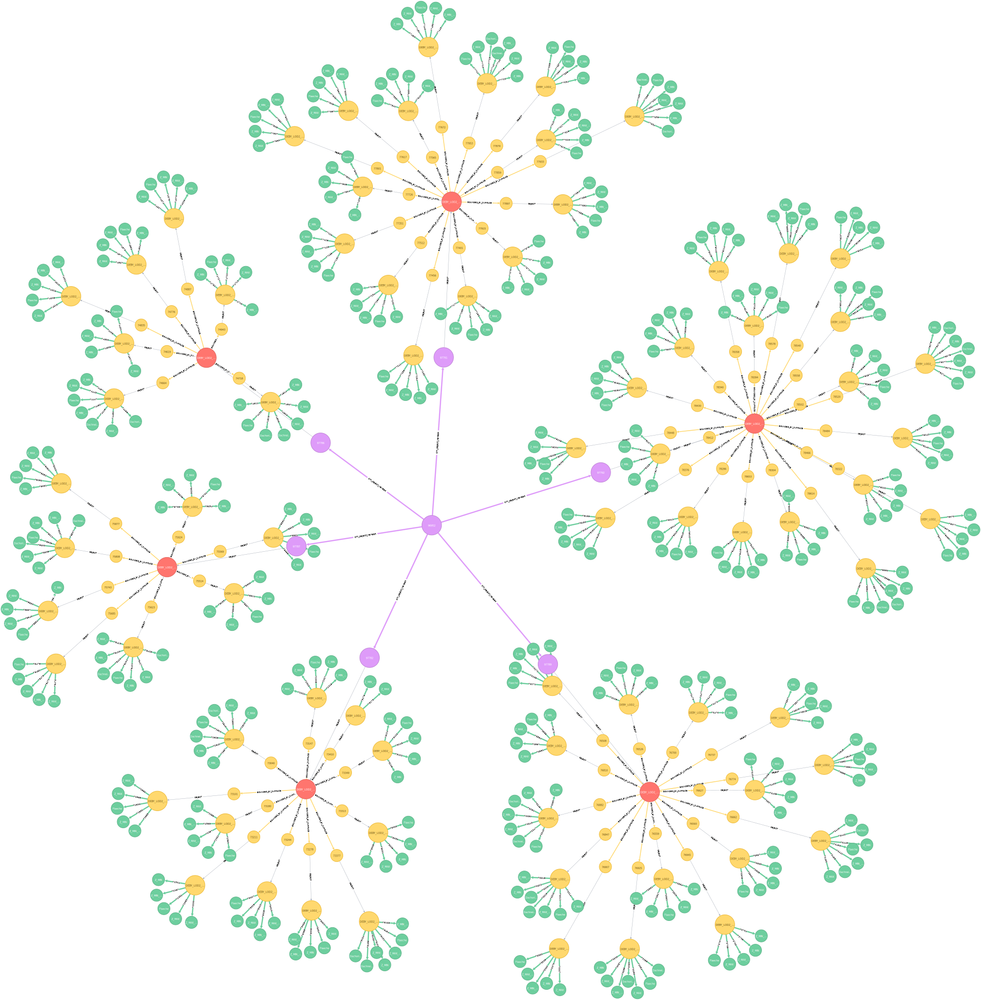

# *citygml-change-detection* 

### :mega: Version [0.1.6](https://github.com/tum-gis/citygml-change-detection/releases/tag/v0.1.6) released!


### :gift: INTRODUCTION

``citygml-change-detection`` is a **high-performance graph-based** tool developed for automatic **change detection** 
in arbitrarily large CityGML datasets. 
The tool is implemented in Java and employs the graph database Neo4j 
as a central storage for the graph representations of CityGML datasets.

### :whale2: HOW TO RUN USING DOCKER

This tool is available as a [Docker Image](https://hub.docker.com/repository/docker/sonnguyentum/citygml-change-detection).
The following example shows how this can be applied in most simple use cases:

1.  Create a working directory, such as `<WORKING_DIR>`.
    This shall be the default project directory in the following steps. 

1.  Create a configuration file:
    ```bash
    mkdir <WORKING_DIR>/config
    touch <WORKING_DIR>/config/config.txt
    ```
    The instructions and examples of such configuration files are given [here](config).

1.  Create a directory to store input CityGML datasets:
    ```bash
    mkdir <WORKING_DIR>/input
    ```
    Then copy the files that need to be matched inside this directory.
    
1.  Pull the latest docker image:
    ```bash
    docker pull sonnguyentum/citygml-change-detection
    ```
    
1.  Run the Docker container based on the pulled image:
    ```bash
    docker run --rm --name citygml-change-detection -it \
      -v <WORKING_DIR>/config:/citygml-change-detection/config \
      -v <WORKING_DIR>/input:/citygml-change-detection/input \
      -v <WORKING_DIR>/output:/citygml-change-detection/output \
      citygml-change-detection \
      "-SETTINGS=config/config.txt"
    ```
    The argument ``--rm`` means that the Docker container is temporary and shall be automatically removed afterwards.

1.  The change detection results are now stored in the directories ``<WORKING_DIR>/output``.

### :ocean: HOW TO BUILD AND PUBLISH IN DOCKER

The Docker image mentioned above was built using this [Dockerfile](Dockerfile).
To build the image, change to the project directory and execute the following command:
```bash
docker build -t citygml-change-detection .
```
OR include a tag to publish in DockerHub:
```bash
docker build -t <username>/<repository>[:Tag] .
docker push <username>/<repository>[:Tag]
```

### :computer: SYSTEM REQUIREMENTS

The application employs the graph database **Neo4j** as a means
to store and process CityGML datasets.
To be able to run the program in Java in the following sections, 
the system must thus meet the **_minimum_** requirements listed in
[Neo4j Operations Manual](https://neo4j.com/docs/operations-manual/current/installation/requirements/).

**IMPORTANT**: **Java 8 is required**!

### :zap: HOW TO RUN IN JAVA

1.  Download the JAR file and its dependencies 
    in the [release section](https://github.com/tum-gis/citygml-change-detection/releases).
   
2.  Create a configuration file (instructions and examples are given [here](config)).

3.  Run the downloaded JAR file in the Command Line Interface (CLI):
    ```bash
    java -jar citygml-change-detection.jar -SETTINGS="path/to/config.txt"
    ```
    
### :hammer: CONFIGURE JAVA VM

Some configurations for the local Java VM can also be applied while running the JAR file:

+   ``-Xms<N>``: specifies the initial amount of main memory (heap space) available
+   ``-Xmx<N>``: specifies the maximum amount of main memory (heap space) available
+   ``-XX:+UseG1G``: employs the concurrent garbage collector `G1GC`. 
    
Note that to save memory, the JVM employs the Compressed Ordinary Object Pointer (OOP) feature 
that compresses object references. This feature is enabled by default in latest versions of JDK. 
The compressed OOPs is activated in 64-bit JVM if the value of flag `-Xmx` is undefined 
or smaller than 32 GB. Therefore, a maximum heap space size value of 32 GB and beyond 
shall deactivate the compressed OOP and thus might cause marginal or negative gains in performance, 
unless the increase in size is significant (64GB or above) as stated in 
[Neo4j Operations Manual](https://neo4j.com/docs/operations-manual/current/).

An example of such parameters:
```bash
java -Xms2048m -Xmx8G -XX:+UseG1GC -jar citygml-change-detection.jar -SETTINGS="path/to/config.txt"
```

### :rocket: HOW TO BUILD

1.  Clone the project:
    ```bash
    git clone https://github.com/tum-gis/citygml-change-detection
    ```

2.  Go to the downloaded folder:
    ```bash
    cd citygml-change-detection
    ```

3.  Build the project using Gradle:
    ```bash
    gradle build
    ```
    OR use the following command to remove old dependencies:
    ```bash
    gradle build --refresh-dependencies --info
    ```

4.  The ``main`` function is located in [controller/CityGMLChangeDetection.java](src/main/java/controller/CityGMLChangeDetection.java).
    This basically calls the constructor:
    ```java
    CityGMLChangeDetection cityGMLChangeDetection = new CityGMLChangeDetection("path/to/config.txt");
    ```
    where ``path/to/config.txt`` is the path to the configuration file required.
    Instructions and examples are given [here](config).
    
5.  *(Optional)* This steps explains how to publish the built project to JFrog Artifactory.
    1.  Enter the registered repository URL, username and password (or API key) 
    for the JFrog Artifactory API in [gradle.properties](gradle.properties):
        ```
        artifactory_contextUrl=https://example.jfrog.io/artifactory
        artifactory_user=john.doe@example.com
        artifactory_password=password_or_api_key
        ```
    2.  Run the following command to publish to JFrog Artifactory:
        ```bash
        gradle artifactoryPublish
        ```

### :bulb: HOW TO READ RESULTS

The tool stores the change detection results by default in the directory [output](output). 
Please refer to the descriptions inside the directory and each of its sub-directories for more details.

### :mag_right: REPOSITORY STRUCTURE

This repository contains the following directories:

| Directory         | Description                                                                                                                                                                                                                                                                                             |
|-------------------|---------------------------------------------------------------------------------------------------------------------------------------------------------------------------------------------------------------------------------------------------------------------------------------------------------|
| [input](input/)   | Location of input CityGML datasets.                                                                                                                                                                                                                                                                     |
| [output](output/) | Location of output files and directories generated while executing the change detection process, this includes [detected changes in CSV files](output/changes/), [log files](output/logs/), [RTree footprints of imported top-level features](output/rtrees/) and [statistics report](output/statbot/). |
| [config](config/) | Location of example settings that can be applied for the change detection process, especially the [default settings](config/Default.txt).                                                                                                                                                               |
| [src](src/)       | Location of the source codes.                                                                                                                                                                                                                                                                           |


-----------------------

### :books: PUBLICATIONS

This project is a part of the on-going PhD research of [Son H. Nguyen](https://www.lrg.tum.de/en/gis/our-team/staff/son-h-nguyen/) at the Chair of Geoinformatics, Department of Aerospace and Geodesy, Technical University of Munich.
For more information on the research, please refer to the following published studies:

* Son H. Nguyen, Thomas H. Kolbe. ["A MULTI-PERSPECTIVE APPROACH TO INTERPRETING SPATIO-SEMANTIC CHANGES OF LARGE 3D CITY MODELS IN CITYGML USING A GRAPH DATABASE"](https://www.isprs-ann-photogramm-remote-sens-spatial-inf-sci.net/VI-4-W1-2020/143/2020/), ISPRS Ann. Photogramm. Remote Sens. Spatial Inf. Sci., VI-4/W1-2020, 143–150, https://doi.org/10.5194/isprs-annals-VI-4-W1-2020-143-2020, 2020. 

* Son H. Nguyen, Zhihang Yao, Thomas H. Kolbe. ["SPATIO-SEMANTIC COMPARISON OF LARGE 3D CITY MODELS IN CITYGML USING A GRAPH DATABASE"](https://gispoint.de/artikelarchiv/gis/2018/gisscience-ausgabe-32018/4612-raeumlich-semantischer-vergleich-grosser-3d-stadtmodelle-in-citygml-unter-verwendung-einer-graph-datenbank.html). gis.Science (3/2018), 2018, 85-100.

* Son H. Nguyen, Zhihang Yao, Thomas H. Kolbe. ["SPATIO-SEMANTIC COMPARISON OF LARGE 3D CITY MODELS IN CITYGML USING A GRAPH DATABASE"](https://www.isprs-ann-photogramm-remote-sens-spatial-inf-sci.net/IV-4-W5/99/2017/), ISPRS Ann. Photogramm. Remote Sens. Spatial Inf. Sci., IV-4/W5, 99-106, https://doi.org/10.5194/isprs-annals-IV-4-W5-99-2017, 2017.

* Son H. Nguyen. ["SPATIO-SEMANTIC COMPARISON OF 3D CITY MODELS IN CITYGML USING A GRAPH DATABASE"](https://mediatum.ub.tum.de/node?id=1374646). Master's Thesis. Department of Informatics, Technical University of Munich (TUM).

We acknowledge the company [CADFEM](https://www.cadfem.net/de/en/), [Virtual City Systems](https://vc.systems/en/) and the 
[Leonhard Obermeyer Center (LOC)](https://www.loc.tum.de/en/home/) of the 
[Technical University of Munich (TUM)](https://www.tum.de/en/) for supporting this work. We also would like to thank
the [Bavarian Agency for Digitisation, High-Speed Internet and Surveying (LDBV)](https://www.ldbv.bayern.de/englisch.html) 
and the [state government of North Rhine-Westphalia](https://www.land.nrw/en) for providing the input datasets.

### :cookie: BACKGROUND

A city may have multiple CityGML documents recorded at different times or surveyed by different users. 
To analyse the city’s evolution over a given period of time, as well as to update 
or edit the city model without negating modifications made by other users, 
it is of utmost importance to first compare, detect and locate spatio-semantic changes 
between CityGML datasets. This is however difficult due to the fact that CityGML elements 
belong to a complex hierarchical structure containing multi-level deep associations, 
which can basically be considered as a graph. Moreover, CityGML allows multiple syntactic ways 
to define an object leading to syntactic ambiguities in the exchange format. 
Furthermore, CityGML is capable of including not only 3D urban objects’ graphical appearances 
but also their semantic properties. Since to date, no known algorithm is capable of 
detecting spatio-semantic changes in CityGML documents, a frequent approach is to replace 
the older models completely with the newer ones, which not only costs computational resources, 
but also loses track of collaborative and chronological changes. 
Thus, this research proposes an approach capable of comparing two arbitrarily large-sized CityGML 
documents on both semantic and geometric level. Detected deviations are then attached 
to their respective sources and can easily be retrieved on demand. 
As a result, updating a 3D city model using this approach is much more efficient as 
only real changes are committed. To achieve this, the research employs a graph database 
as the main data structure for storing and processing CityGML datasets in three major steps: 
mapping, matching and updating. The mapping process transforms input CityGML documents 
into respective graph representations. The matching process compares these graphs and attaches 
edit operations on the fly. Found changes can then be executed using the Web Feature Service (WFS), 
the standard interface for updating geographical features across the web.

The (ongoing) implementation of this research is stored and maintained in this repository.



### :open_file_folder: License

This project is licensed under the 
[Apache License, Version 2.0](http://www.apache.org/licenses/LICENSE-2.0). 
See the [LICENSE](LICENSE) file for more details.


