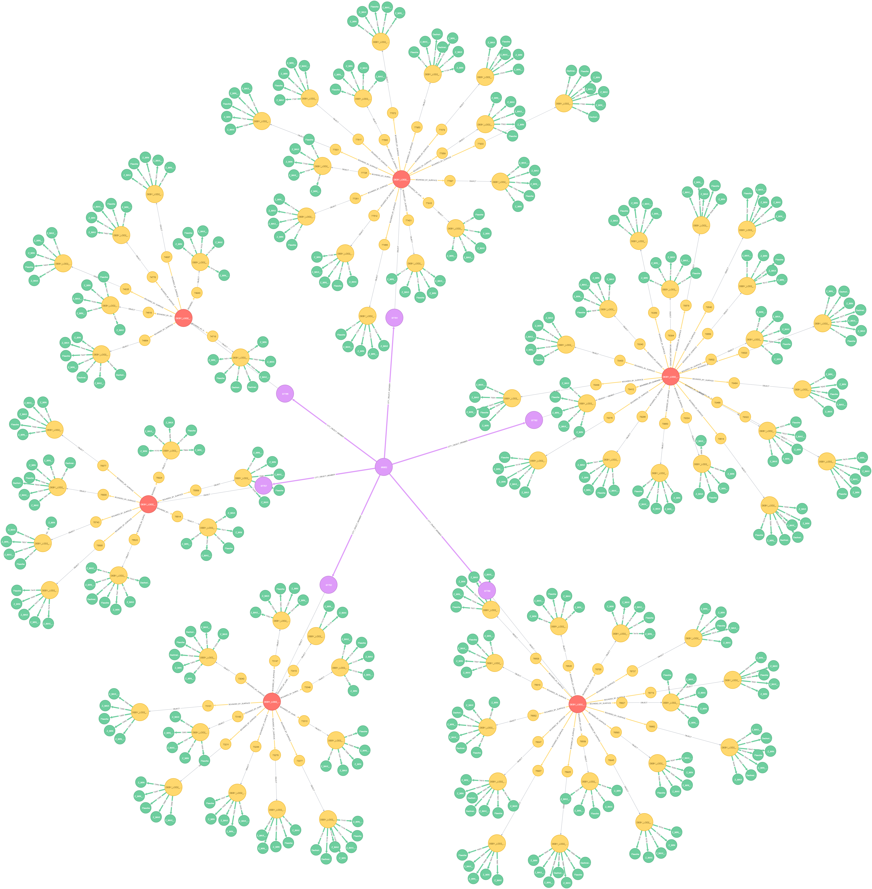

# citygml-change-detection

The source codes in this repository are based on the following articles:

* Son H. Nguyen. ["SPATIO-SEMANTIC COMPARISON OF 3D CITY MODELS IN CITYGML USING A GRAPH DATABASE."](https://mediatum.ub.tum.de/node?id=1374646) Master's Thesis. Department of Informatics, Technical University of Munich (TUM).

* Son H. Nguyen, Zhihang Yao, Thomas H. Kolbe. "SPATIO-SEMANTIC COMPARISON OF LARGE 3D CITY MODELS IN CITYGML USING A GRAPH DATABASE." In: 12th 3D Geoinfo Conference 2017.


# Introduction

A city may have multiple CityGML documents recorded at different times or surveyed by different users. To analyse the city’s evolution over a given period of time, as well as to update or edit the city model without negating modifications made by other users, it is of utmost importance to first compare, detect and locate spatio-semantic changes between CityGML datasets. This is however difficult due to the fact that CityGML elements belong to a complex hierarchical structure containing multi-level deep associations, which can basically be considered as a graph. Moreover, CityGML allows multiple syntactic ways to define an object leading to syntactic ambiguities in the exchange format. Furthermore, CityGML is capable of including not only 3D urban objects’ graphical appearances but also their
semantic properties. Since to date, no known algorithm is capable of detecting spatio-semantic changes in CityGML documents, a frequent approach is to replace the older models completely with the newer ones, which not only costs computational resources, but also loses track of collaborative and chronological changes. Thus, this research proposes an approach capable of comparing two arbitrarily large-sized CityGML documents on both semantic and geometric level. Detected deviations are then attached to their respective sources and can easily be retrieved on demand. As a result, updating a 3D city model using this approach is much more efficient as only real changes are committed. To achieve this, the research employs a graph database as the main data structure for storing and processing CityGML datasets in three major steps: mapping, matching and updating. The mapping process transforms input CityGML documents into respective graph representations. The matching process compares these graphs and attaches edit operations on the fly. Found changes can then be executed using the Web Feature Service (WFS), the standard interface for updating geographical features across the web.

The (ongoing) implementation of this research is stored and maintained in this repository.




# License

The **citygml-change-detection** repository is licensed under the [Apache License, Version 2.0](http://www.apache.org/licenses/LICENSE-2.0). See the [LICENSE](LICENSE) file for more details.


# Developers

The **citygml-change-detection** repository is being developed by:

* [Son H. Nguyen.](https://www.gis.bgu.tum.de/en/our-team/staff/son-nguyen/) <br>
[Chair of Geoinformatics. Department of Civil, Geo and Environmental Engineering.](https://www.gis.bgu.tum.de/en/home/) <br>
[Technical University of Munich (TUM).](https://www.tum.de/en/)

with the support of:

* [Zhihang Yao.](https://www.gis.bgu.tum.de/en/our-team/staff/zhihang-yao/) <br>
[Chair of Geoinformatics. Department of Civil, Geo and Environmental Engineering.](https://www.gis.bgu.tum.de/en/home/) <br>
[Technical University of Munich (TUM).](https://www.tum.de/en/)

* [Univ.-Prof. Dr. rer. nat. Thomas H. Kolbe.](https://www.gis.bgu.tum.de/en/our-team/staff/prof-thomas-h-kolbe/) <br>
[Chair of Geoinformatics. Department of Civil, Geo and Environmental Engineering.](https://www.gis.bgu.tum.de/en/home/) <br>
[Technical University of Munich (TUM).](https://www.tum.de/en/)


This repository is a part of the [TUM-GIS](https://github.com/tum-gis) repository, the official GitHub page of the Chair of Geoinformatics, Department of Civil, Geo and Environmental Engineering, Technical University of Munich.


# Folder Structure

The stand-alone version can be executed from within this folder. For this purpose, the following files as well as sub-folders are required:

### Files:


* [CityGMLChangeDetection.jar](CityGMLChangeDetection.jar): The source codes are included in this file, which can then be manually executed in Windows, Linux, etc. using the `-jar` command.


* [run.bat](run.bat) and [run.sh](run.sh): The program can be automatically started using the BATCH-script `.bat` in Windows or the SHELL-script `.sh` in Linux.


* [Settings.txt](Settings.txt): All run configurations can be modified here. 


### Sub-folders:


* [CityGMLChangeDetection_lib](CityGMLChangeDetection_lib/): All dependencies are included here (as `.jar` files). Do NOT change any library in this folder or else the program cannot function correctly.


* [export](export/): If deviations are found between two city models, the corresponding edit operations created on-the-fly shall be documented here in 6 CSV files. Fore more information please refer to the respective [README](export/README.md) there.

    
* [logs](logs/): Program and execution logs are stored here for debugging purposes.


* [neo4jDB](neo4jDB/): The Neo4j database instance employed during program execution shall be stored here. For querying and visualization purposes, the Neo4j web client can be pointed to this location. Note that the size of this database tends to increase over time as more and more transaction logs are stored. These data can be removed. In fact, when the program is complete, user is asked whether to keep or delete this (temporary) database.


* [saved_pictures](saved_pictures/): If spatial matching strategy R-tree is enabled, R-tree pictures of input city models shall be created and stored here. These signature pictures visualized R-trees of respective city models by representing each R-tree node as a rectangle, while their colors indicate node levels in the R-tree (see illustrations below).
    

* [test_data](test_data/): Input CityGML city models are supposed to be stored here.


**IMPORTANT:** The configuration file [Settings.txt](Settings.txt) dictates which folders shall be used for which data. The above-mentioned structure follows therefore only the default configurations.


# Start the Program


### Windows:


Note that the existing Neo4j database instance stored in [neo4jDB](neo4jDB/) shall be deleted each time the program is started. A backup is therefore advised if the old database contains important data. 


1. Open command line
2. Navigate to this folder
3. Enter the following command to start the program:
```batch
run.bat
```
    

### Linux:

Note that the existing Neo4j database instance stored in [neo4jDB](neo4jDB/) shall be deleted each time the program is started. A backup is therefore advised if the old database contains important data. 

1. Open terminal
2. Navigate to this folder
3. Enter the following commands to start the program:
```shell
chmod +x run.sh
./run.sh
```

# Change Run Configurations


### Assign Heap Space Size


By default, an initial and maximum amount of 1000 MB is assigned for the heap space. These can be modified using the following steps:


#### Windows: 


Open [run.bat](run.bat) with a text editor.


Change the following line:

```batch
java -Xms1000m -Xmx1000m -XX:+UseG1GC -jar CityGMLChangeDetection.jar -SETTINGS="Settings.txt"
```
    
to

```batch
java -Xms<InitAmount>m -Xmx<MaxAmount>m -XX:+UseG1GC -jar CityGMLChangeDetection.jar -SETTINGS="Settings.txt"
```

    
 where `<InitAmount>` and `<MaxAmount>` indicates initial and maximum amount of heap space (in MB) respectively and are thus to be replaced by concrete non-zero integers.
 
 
#### Linux:


Open [run.sh](run.sh) with a text editor.


Change the following line:

```shell
java -Xms1000m -Xmx1000m -XX:+UseG1GC -jar CityGMLChangeDetection.jar -SETTINGS="Settings.txt"
```

to

```shell
java -Xms<InitAmount>m -Xmx<MaxAmount>m -XX:+UseG1GC -jar CityGMLChangeDetection.jar -SETTINGS="Settings.txt"
```
    
where `<InitAmount>` and `<MaxAmount>` indicate initial and maximum amount of heap space (in MB) respectively and are thus to be replaced by concrete non-zero integers.
 
 
 ### Modify Program Configurations
 
 
 All configurations can be modified within [Settings.txt](Settings.txt), where:
 
 
 #### Miscellaneous:
 
 Option | Meaning
 ---- | ----------------------------------------------------------------------------------
 `#` | Lines starting with the `#` letter are marked as comments and will not be parsed. 
 `USER_MESSAGE` | Contains comments for the current test run.
 
 
 ####  Database and program settings:
 
 Option | Meaning | Default value
 ---- | --- | ---
 `HOME_LOCATION` | Home location of this stand-alone version. If left empty, the current (relative) location of this configuration file shall be used. | 
 `TEST_DATA_LOCATION` | Location of datasets to be matched. | `test_data/`
 `OLD_CITY_MODEL_LOCATION` | Location of old city model. | `Polygon_Multi_Interior_0.gml`
 `NEW_CITY_MODEL_LOCATION` | Location of new city model. | `Polygon_Multi_Interior_1.gml`
 `DB_LOCATION` | Location of Neo4j database. | `neo4jDB/`
 `LOG_LOCATION` | Location of log files. | `log/`
 `EXPORT_LOCATION` | Location of exported CSV files storing edit operations. | `export/`
 `CSV_DELIMITER` | Delimiter used to separate columns in CSV files. | `;`
 `WFS_SERVER` | URL/Address of WFS server. | 
 `RTREE_IMAGE_LOCATION` | Location of R-tree signature images. | `saved_pictures/rtrees/`
 

 #### Mapper settings:
 
 Option | Meaning | Default value
 ---- | --- | ---
 `ENABLE_MULTI_THREADED_MAPPING` | Run the mapping process in multi-threaded mode. | `true`
 `NR_OF_PRODUCERS` | If multi-threading is enabled, this defines how many producers can run concurrently. The value `1` is recommended, since the mapping process is more likely dependent on the slower read/write disk operations. | `1`
 `CONSUMERS_PRO_PRODUCER` | If multi-threading is enabled, this defines how many consumers **per producer** can run concurrently. It is advised to choose values below `N / (NR_OF_PRODUCERS + 1)`, where `N` is the total number of available physical CPU cores in the testing system. | `7`
 `ENABLE_INDICES` | Use Neo4j's built-in indices stored on disk if this value is `true`, or else the self-developed indexing mechanism using internal hash maps shall be employed. Note that using the latter results in significant performance boosts but requires a large amount of main memory, while the former does not require as much main memory but may run slower due to expensive disk operations. | `false`
 `SPLIT_PER_COLLECTION_MEMBER` | In order to parse large datasets efficiently, city objects are often split into smaller chunks (or pieces). If this value is set to `true`, each of these chunk shall be a top-level feature (e.g. a building). | `true`
 `NR_OF_COMMIT_BUILDINGS` | To accelerate mapping time, buildings are processed in batches. This determines how many buildings should be processed before the next commit. | `10` 
 `NR_OF_COMMIT_FEATURES` | To accelerate mapping time, features are processed in batches. This determines how many features should be processed before the next commit. | `100` 
 `NR_OF_COMMMIT_TRANS` | To accelerate mapping time, transactions are committed in batches. This determines how many transactions should be grouped together before the next commit. | `5000` 
 `LOG_EVERY_N_BUILDINGS` | Determines how often it should be logged depending on the number of newly processed buildings since the last log write. | `10`
 
 
 #### Matcher settings:

 Option | Meaning | Default value
 ---- | --- | ---
`MATCHING_STRATEGY` | Two spatial strategies are available: `RTREE` or `TILES`. The former employs an R-tree to enable efficient spatial querying using bounding rectangles. The latter assigns spatial objects to cells organised in a grid layout. If no spatial strategy is used, set this field to `NONE`. Note that `NONE` will automatically disable multi-threading. | `RTREE`
 `ENABLE_MULTI_THREADED_MAPPING` | Run the matching process in multi-threaded mode. If `true`, the number of producers and consumers per producers shall be the same as `NR_OF_PRODUCERS` and `CONSUMERS_PRO_PRODUCER` respectively as described above in the mapping process. Note that only the strategies `RTREE` and `TILES` are applicable to multi-threading. `NONE` is single-threaded only. | `true`
 `MAX_RTREE_NODE_REFERENCES` | R-trees are balanced, which means that each internal node can only have a fixed maximum number of child nodes, which is determined by this parameter (only valid if `RTREE` mode is enabled). | `10`
 `TILE_UNIT_X` | A grid is composed of a number of grid cells. Each cell has a rectangular shape and is defined by its width (`X`) and height (`Y`). This field defines the width (in meters) of each of these grid cells (only valid if `TILES` mode is enabled). | `100`
 `TILE_UNIT_Y` | A grid is composed of a number of grid cells. Each cell has a rectangular shape and is defined by its width (`X`) and height (`Y`). This field defines the height (in meters) of each of these grid cells (only valid if `TILES` mode is enabled). | `100`
 `ERR_TOLERANCE` | Maximum allowed rounding error tolerances in meters. | `1e-7` 
 `ANGLE_TOLERANCE` | Maximum allowed angle tolerances in radians. | `1e-3` 
 `DISTANCE_TOLERANCE` | Maximum allowed distance tolerances in meters. | `1e-3` 
 `TILE_BORDER_DISTANCE` | This parameter defines how far (in meters) the uncertainty (or buffer) zones can spread from the respective tile borders (only valid if `TILES` mode is enabled). | `5` 
 `MATCH_BUILDINGS_BY_SHARED_VOLUME` | To efficiently and correctly find matching building candidates, their shared volumes (3D, if `true`) or footprints (2D, if `false`) are often used as a matching pattern. | `true`
 `BUILDING_SHARED_VOL_PERCENTAGE_THRESHOLD` | Building candidates are matched if their relative shared volume or footprint exceeds this value. | `0.9`
 `CREATE_MATCHED_CONTENT_NODE` | Each time two nodes are matched with identical contents, an auxiliary node shall be created indicating this relationship (if `true`). Note that enabling this will result in a large number of auxiliary nodes and may have a negative effect on run time. | `false`
 `CREATE_MATCHED_GEOMETRY_NODE` | Each time two nodes are geometrically or spatially matched, an auxiliary node shall be created indicating this relationship (if `true`). Note that enabling this will result in a large number of auxiliary nodes and may have a negative effect on run time. | `false`
 `THREAD_TIME_OUT` | This field defines how long the program can wait (in milliseconds) for all threads to finish before moving on to the next tasks (only valid if multi-threading is enabled). | `500,000`
 
 
 #### Updater settings:
 
 Option | Meaning | Default value
 ---- | --- | ---
`ENABLE_EDITORS` | Enable or disable the updater. | `false`
 `EXECUTE_OPTIONAL` | Geometrically matched objects are often also equivalent to each other despite their syntactical differences. In such cases, a flag `IS_OPTIONAL` is set to the respective edit operations. If this field is set to `true`, then all edit operations flagged as `IS_OPTIONAL` shall be executed, otherwise no action shall take place. | `false`
